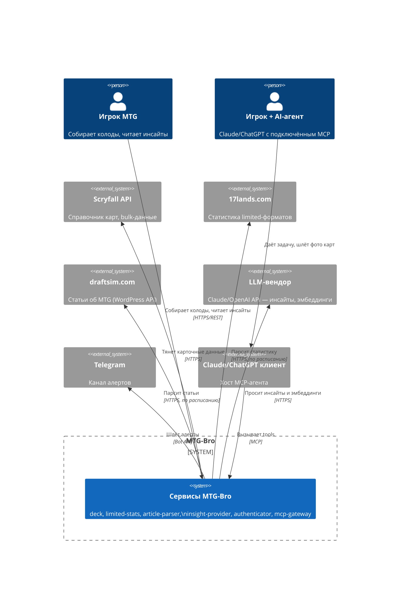

# Архитектура MTG-Bro

Этот каталог описывает всё, что затрагивает больше одного сервиса: интеграции,
потоки данных, контракты, эксплуатацию. Специфика конкретного сервиса живёт в
его собственном `services/<name>/CLAUDE.md`.

## Карта документов

| Файл | О чём |
|---|---|
| [overview.md](overview.md) | Контейнерная диаграмма — кто с кем и чем говорит |
| [services.md](services.md) | Реестр сервисов: зона ответственности, схема БД, топики, порты, статус |
| [data-flows.md](data-flows.md) | Пользовательские кейсы как sequence-диаграммы |
| [api-contracts.md](api-contracts.md) | REST наружу / gRPC внутрь, версионирование, формат ошибок |
| [messaging.md](messaging.md) | Kafka: топики, ключи, схемы событий, outbox, DLQ |
| [persistence.md](persistence.md) | Postgres: схемы, роли, sqlc, миграционный паттерн |
| [observability.md](observability.md) | Метрики, health-checks, алерты в Telegram |
| [security.md](security.md) | OAuth2, JWKS, identity в gRPC, секреты |
| [deployment.md](deployment.md) | docker compose prod, домены, ресурсный бюджет, CI-джобы |
| [patterns.md](patterns.md) | Какие паттерны распределённых систем применены и зачем |
| [roadmap.md](roadmap.md) | Вехи реализации M0–M7 |
| [adr/](adr/) | Журнал архитектурных решений |

## Контекст системы (C4 L1)

## Принцип: один источник правды

- Схема БД и SQL — источник правды для sqlc, а не наоборот.
- `.proto`-контракты в `libs/proto` — источник правды для gRPC, генерация клиентов/серверов через buf.
- `docs/arch/services.md` — источник правды о том, какие сервисы существуют и чем владеют; при добавлении/переименовании сервиса правится в первую очередь.
