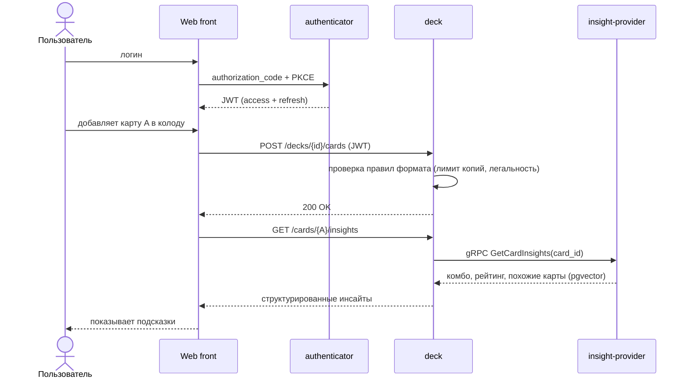
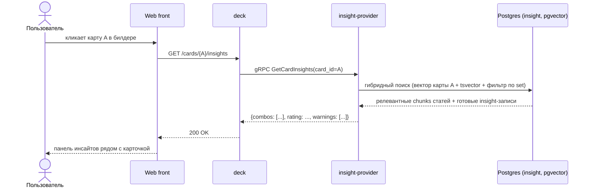
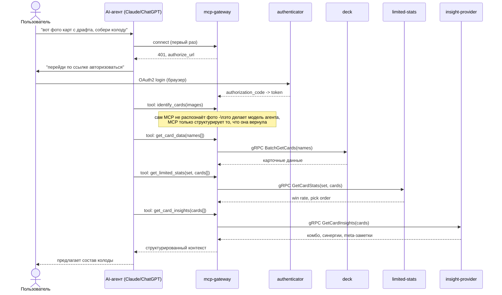
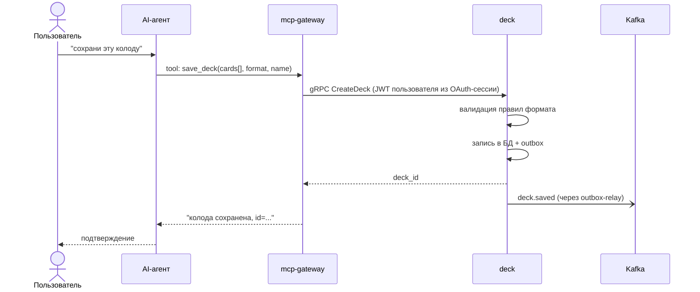

# Пользовательские сценарии

## 1. Сборка колоды с инсайтами

```mermaid
sequenceDiagram
    actor U as Пользователь
    participant Web as Web front
    participant Auth as authenticator
    participant Deck as deck
    participant Insight as insight-provider

    U->>Web: логин
    Web->>Auth: authorization_code + PKCE
    Auth-->>Web: JWT (access + refresh)
    U->>Web: добавляет карту A в колоду
    Web->>Deck: POST /decks/{id}/cards (JWT)
    Deck->>Deck: проверка правил формата (лимит копий, легальность)
    Deck-->>Web: 200 OK
    Web->>Deck: GET /cards/{A}/insights
    Deck->>Insight: gRPC GetCardInsights(card_id)
    Insight-->>Deck: комбо, рейтинг, похожие карты (pgvector)
    Deck-->>Web: структурированные инсайты
    Web-->>U: показывает подсказки
```

## 2. Инсайт по выбранной карте (детально)

```mermaid
sequenceDiagram
    actor U as Пользователь
    participant Web as Web front
    participant Deck as deck
    participant Insight as insight-provider
    participant PG as Postgres (insight, pgvector)

    U->>Web: кликает карту A в билдере
    Web->>Deck: GET /cards/{A}/insights
    Deck->>Insight: gRPC GetCardInsights(card_id=A)
    Insight->>PG: гибридный поиск (вектор карты A + tsvector + фильтр по set)
    PG-->>Insight: релевантные chunks статей + готовые insight-записи
    Insight-->>Deck: {combos: [...], rating: ..., warnings: [...]}
    Deck-->>Web: 200 OK
    Web-->>U: панель инсайтов рядом с карточкой
```

## 3. Sealed/draft через MCP по фото карт

```mermaid
sequenceDiagram
    actor U as Пользователь
    participant Agent as AI-агент (Claude/ChatGPT)
    participant MCP as mcp-gateway
    participant Auth as authenticator
    participant Deck as deck
    participant Stats as limited-stats
    participant Insight as insight-provider

    U->>Agent: "вот фото карт с драфта, собери колоду"
    Agent->>MCP: connect (первый раз)
    MCP-->>Agent: 401, authorize_url
    Agent->>U: "перейди по ссылке авторизоваться"
    U->>Auth: OAuth2 login (браузер)
    Auth-->>MCP: authorization_code -> token
    Agent->>MCP: tool: identify_cards(images)
    Note over MCP: сам MCP не распознаёт фото -\nэто делает модель агента,<br/>MCP только структурирует то, что она вернула
    Agent->>MCP: tool: get_card_data(names[])
    MCP->>Deck: gRPC BatchGetCards(names)
    Deck-->>MCP: карточные данные
    Agent->>MCP: tool: get_limited_stats(set, cards[])
    MCP->>Stats: gRPC GetCardStats(set, cards)
    Stats-->>MCP: win rate, pick order
    Agent->>MCP: tool: get_card_insights(cards[])
    MCP->>Insight: gRPC GetCardInsights(cards)
    Insight-->>MCP: комбо, синергии, meta-заметки
    MCP-->>Agent: структурированный контекст
    Agent-->>U: предлагает состав колоды
```

## 4. Сохранение AI-собранной колоды

```mermaid
sequenceDiagram
    actor U as Пользователь
    participant Agent as AI-агент
    participant MCP as mcp-gateway
    participant Deck as deck
    participant Kafka as Kafka

    U->>Agent: "сохрани эту колоду"
    Agent->>MCP: tool: save_deck(cards[], format, name)
    MCP->>Deck: gRPC CreateDeck (JWT пользователя из OAuth-сессии)
    Deck->>Deck: валидация правил формата
    Deck->>Deck: запись в БД + outbox
    Deck-->>MCP: deck_id
    Deck-)Kafka: deck.saved (через outbox-relay)
    MCP-->>Agent: "колода сохранена, id=..."
    Agent-->>U: подтверждение
```
