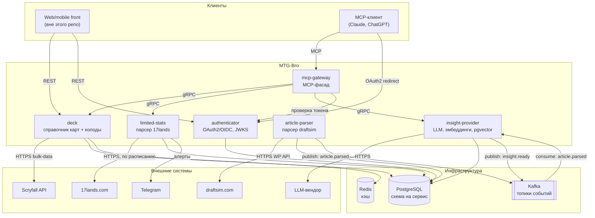

# Контейнерная диаграмма (C4 L2)

## Правила взаимодействия

- **Внутри системы — gRPC.** Сервис-сервис вызовы (`mcp-gateway → deck`, проверка токена и т.п.) идут через gRPC с контрактами из `libs/proto`. Обоснование и детали — [api-contracts.md](api-contracts.md), [ADR-0002](adr/0002-grpc-internal-rest-external.md).
- **Наружу — REST+OpenAPI.** Веб/мобильный фронт и прямые интеграции — REST. MCP-клиент говорит с `mcp-gateway` по протоколу MCP, не REST и не gRPC.
- **Асинхронно — Kafka.** Пайплайн статей → инсайтов асинхронный от начала до конца: `article-parser` ничего не ждёт от `insight-provider` синхронно. Детали — [messaging.md](messaging.md).
- **Каждый сервис владеет своей схемой БД.** Ни один сервис не читает чужую схему напрямую — только через gRPC. Исключение обсуждается отдельно, если возникнет.
- **JWKS раздаёт `authenticator`.** Остальные сервисы верифицируют JWT локально через `libs/authx`, не ходят в `authenticator` на каждый запрос (кроме первичной загрузки/ротации ключей).
